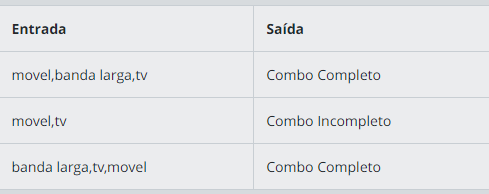

## Descrição
Implemente um sistema que verifique se um cliente de uma empresa de telecomunicações contratou um combo completo de serviços. Um combo completo inclui os três serviços principais oferecidos pela empresa: telefonia móvel, banda larga e TV por assinatura. O sistema deve ler uma lista de serviços contratados pelo cliente e determinar se todos os serviços necessários estão incluídos. Caso todos os três serviços estejam presentes, o sistema deve retornar "Combo Completo". Se faltar qualquer um dos serviços, o sistema deve retornar "Combo Incompleto".

## Entrada
A entrada consiste em uma string contendo uma lista de serviços contratados pelo cliente, separados por vírgula. Os serviços possíveis são "movel" para telefonia móvel, "banda larga" para serviços de internet e "tv" para TV por assinatura.

## Saída
A saída do programa deve ser uma única linha contendo:

"Combo Completo" se o cliente contratou todos os três serviços.
"Combo Incompleto" caso contrário.
Exemplos
A tabela abaixo apresenta exemplos com alguns dados de entrada e suas respectivas saídas esperadas. Certifique-se de testar seu programa com esses exemplos e com outros casos possíveis.
